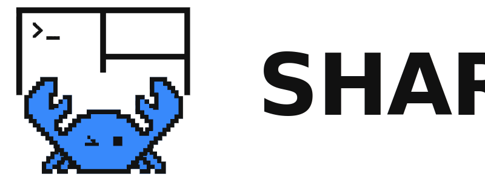
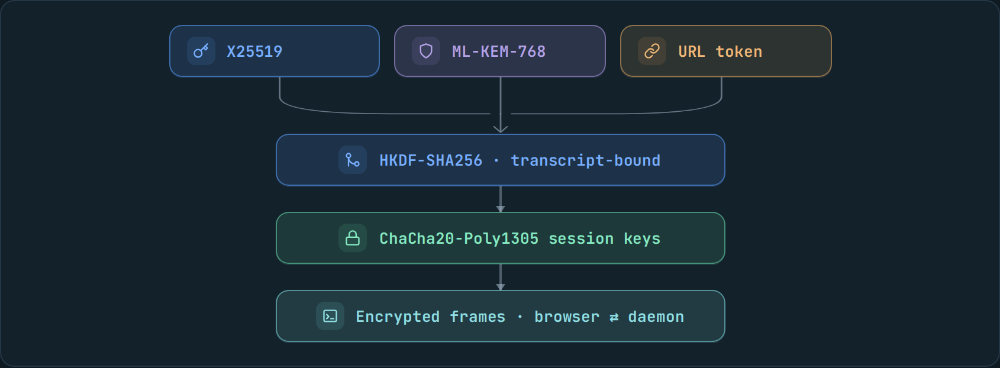

<div align="center">

<a href="https://rmux.io">
  <picture>
    <source media="(prefers-color-scheme: dark)" srcset="share-header-dark.svg">
    
  </picture>
</a>

**Browser sharing for RMUX terminal panes and sessions.**

[](https://github.com/Helvesec/rmux/releases/tag/v0.6.0)
[](#cryptography)
[](#cryptography)
[](#architecture)

</div>

## Web Multiplex

<p align="center">
  
</p>

`rmux web-share` opens an existing RMUX pane or session in a browser.

Execution stays local. The daemon keeps running the PTY, panes, windows, and process lifecycle on your machine. The browser receives encrypted terminal frames and sends encrypted input back to the daemon.

The frontend is a static HTML/JS/WASM application. It can be loaded from `share.rmux.io`, from your own CDN, or from any static host you choose with `--frontend-url`. The daemon does not need to serve web assets.

```sh
# Share the current pane over loopback
rmux web-share

# Share a named session
rmux web-share -t work

# Share through a public tunnel provider
rmux web-share --tunnel-provider localhost-run
```

## Architecture

RMUX separates three responsibilities that are often bundled together:

- **Local execution**: shells and PTYs stay under the local RMUX daemon.
- **Decoupled frontend**: the browser app is CDN-hosted or self-hosted static content.
- **Encrypted transport**: tunnels and relays only forward ciphertext.

That split keeps deployment flexible. You can use the public frontend, pin your own static build, or route traffic through a tunnel provider without giving that provider terminal plaintext.

## Key Features

- **Multiplexer first**: share an existing RMUX pane or session instead of launching a one-off shell wrapper.
- **Blind relay model**: tunnel providers forward encrypted frames and cannot read terminal payloads.
- **Authenticated encryption**: terminal traffic uses ChaCha20-Poly1305, so tampering is detected.
- **Fresh session keys**: each share negotiates new browser-to-daemon keys.
- **Hybrid post-quantum handshake**: X25519 and ML-KEM-768 are combined for key agreement.
- **Decoupled frontend**: `share.rmux.io` is just the default static client; `--frontend-url` lets you bring your own.
- **Scoped access**: Operator links can send input; Spectator links are read-only.

## Cryptography

<div align="center">

<picture>
  <source media="(prefers-color-scheme: dark)" srcset="rmux-web-share-crypto-dark.png">
  <source media="(prefers-color-scheme: light)" srcset="rmux-web-share-crypto-light.png">
  
</picture>

</div>

Each browser session negotiates fresh symmetric keys using a hybrid key exchange:

- Ephemeral **X25519** key agreement.
- **ML-KEM-768** post-quantum key encapsulation.
- Transcript binding to the URL token and session handshake.

All terminal frames are encrypted with **ChaCha20-Poly1305** directly between the browser and the local daemon.

## Comparison

RMUX combines blind relay, authenticated encryption, forward secrecy, Hybrid Post-Quantum key agreement, a decoupled frontend, and a real terminal multiplexer.

| Tool | Browser | Blind relay¹ | Authenticated² | Forward secrecy | Hybrid Post-Quantum | Decoupled frontend³ | Multiplexer | Self-host | No account | Mobile |
| :--- | :---: | :---: | :--- | :---: | :---: | :---: | :---: | :---: | :---: | :---: |
| **RMUX** | ✅ | ✅ | ✅ ChaCha20-Poly1305 | ✅ X25519 eph. | ✅ X25519 + ML-KEM-768 | ✅ | ✅ | ✅ | ✅ | ✅ |
| sshx | ✅ | ✅ | ❌ AES-CTR, no MAC | ❌ URL key | ❌ | ❌ served by relay | ❌ | △ | ✅ | △ |
| tmate | △ | ❌ relay sees plaintext | — | — | ❌ | ❌ | ✅ | △ | ✅ | ❌ |
| ttyd / GoTTY | ✅ | ❌ server runs shell | — | — | ❌ | ❌ embedded in binary/server | ❌ | ✅ | ✅ | △ |
| Upterm | ❌ | △ SSH to relay | — | — | ❌ | ❌ | ❌ | ✅ | ✅ | ❌ |
| VS Code Tunnels | ✅ | ❌ vendor server | — | — | ❌ | ❌ | ❌ | ❌ | ❌ | △ |
| Warp sharing | △ | ❌ vendor server | — | — | ❌ | ❌ | ❌ | ❌ | ❌ | ✅ |

¹ Blind relay means the relay or host does not receive terminal plaintext. ² Authenticated means tampering is detected by an AEAD or equivalent authenticated transport. ³ Decoupled frontend means the browser client is separate from the daemon and can be hosted on a CDN or static origin.

References for the non-RMUX rows: [sshx](https://github.com/ekzhang/sshx), [sshx-server](https://docs.rs/crate/sshx-server/latest), [tmate](https://github.com/tmate-io/tmate), [ttyd](https://github.com/tsl0922/ttyd), [GoTTY](https://github.com/sorenisanerd/gotty), and [Upterm](https://upterm.dev/docs/upterm.html).

## Access Control

| Role | Keyboard Input | Default Use Case |
| :--- | :---: | :--- |
| **Operator** | ✅ Enabled | Full interactive shell control |
| **Spectator** | ❌ Disabled | Read-only terminal view |

```sh
# Restrict sharing to read-only spectators
rmux web-share --spectator-only

# Configure custom pairing PINs for each role
rmux web-share --pin-operator 123456 --pin-spectator 789012

# Set limits and expiration
rmux web-share --max-spectators 10 --ttl 3600
```

Web Share uses these browser-visible close codes:

| Code | Reason | Browser behavior |
| :--- | :--- | :--- |
| `1000` | `session_closed` or share shutdown | Ends the view cleanly. |
| `4000` | `handshake_rejected` | Generic refusal for bad links, expired shares, wrong PINs, origin rejection, and pre-auth capacity. |
| `4001` | `viewer_backpressure` | Closes slow viewers that cannot keep up with output. |
| `4002` | `operator_frame_too_large` | Rejects oversized operator input frames. |
| `4006` | command or role violation | Rejects unsupported actions, spectator writes, pane-only session actions, and malformed control frames. |
| `4008` | `pin_required` | Prompts for the pairing PIN after token authentication. |

`4008` is only used after the share token is valid. Bad links, expired shares, missing roles, wrong PINs, and authenticated capacity failures stay on the generic `4000` path so the browser does not become a token, PIN, or capacity oracle.

## Tunnels & Custom Domains

You can share over loopback, a private network, or the public internet:

```sh
# Private sharing over your VPN
rmux web-share --tunnel-provider tailscale-serve

# Public sharing using a built-in SSH tunnel preset
rmux web-share --tunnel-provider localhost-run

# Custom external tunnel address
rmux web-share --tunnel-url https://my-tunnel.example.com

# Custom static frontend
rmux web-share --frontend-url https://share.example.com
```

For public demos, keep the public link read-only and put per-IP throttling at the edge:

```sh
rmux web-share -t demo --spectator-only --max-spectators 150 --tunnel-url https://demo.rmux.io
```

`rmux web-share` binds the daemon listener to loopback, so it cannot reliably tell public viewers apart by source IP once traffic arrives through a tunnel. Use your tunnel, CDN, or reverse proxy for per-IP limits. For example, a named Cloudflare Tunnel or nginx can cap WebSocket connections by client IP before traffic reaches RMUX.

Account-less Cloudflare Quick Tunnels (`trycloudflare.com`) are intentionally not shipped as a built-in provider. They are useful for casual experiments, but their hostnames can take an unpredictable amount of time to become reachable and Cloudflare does not provide uptime guarantees for them. For a demo or Show HN, use a named tunnel or your own ingress and pass its stable URL with `--tunnel-url`.

## CLI Commands

```sh
# List active shares
rmux web-share list

# Inspect details of a share
rmux web-share lookup <share-id>

# Stop a specific share
rmux web-share stop <share-id>

# Terminate all active shares
rmux web-share off

# Show web-share config
rmux web-share config
```

## Security Model & Threat Boundaries

- **End-to-end encryption**: hosts and tunnel providers cannot read terminal payloads.
- **URL fragment tokens**: access tokens live in the URL fragment (`#t=...`), which browsers do not send to the static frontend host in HTTP requests.
- **Supply-chain control**: if you want full ownership of the browser asset path, self-host the static frontend and pass `--frontend-url`.
- **Operator safety**: treat operator URLs as shell credentials; they grant active input control over your local terminal.

## GitHub Docs

[Read the full Web Share documentation](https://rmux.io/docs/web-share/).
